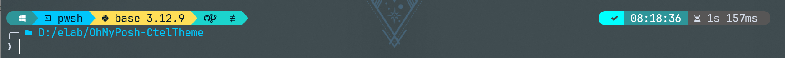

# OhMyPosh-CoolTheme

## About

This is a Ctel (short for stellar) theme for [Oh-My-Posh](https://github.com/JanDeDobbeleer/oh-my-posh) PowerShell theme engine. This theme is based on [kushal](https://github.com/JanDeDobbeleer/oh-my-posh/blob/main/themes/kushal.omp.json) theme and [thecyberden](https://github.com/JanDeDobbeleer/oh-my-posh/blob/main/themes/thecyberden.omp.json) theme that is supplied with Oh-My-Posh.



## How to use

Follow the installation instructions from [Oh-My-Posh](https://github.com/JanDeDobbeleer/oh-my-posh) to install Oh-My-Posh.

Clone the repository to a path that is not easily deleted.

You can use the following command to preview the theme:

```powershell
oh-my-posh init pwsh --config "$env:path\to\theme\ctel.omp.json" | Invoke-Expression
```

To use this theme at powershell startup, type `$PROFILE` to get the PowerShell configuration file, edit it using Notepad, and add the following code:

```powershell
oh-my-posh init pwsh --config "$env:path\to\theme\ctel.omp.json" | Invoke-Expression
```

Note that the `path\to\theme` is modified to the actual location of the theme file.